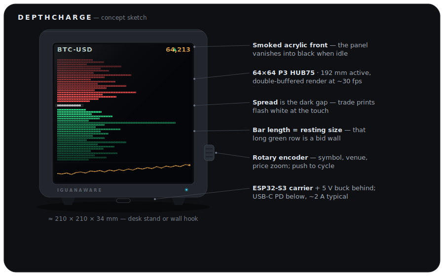

# DepthCharge

A physical limit-order-book display: an ESP32-S3 driving a 64×64 RGB LED matrix behind
smoked acrylic, rendering live market depth — bids stacking green, asks red, trade prints
flashing white at the touch, and an honest grey "stale" state whenever the data can't be
trusted.



It consumes three venues in ascending order of wire difficulty: **Anvil**
([anvil.garethcooke.com](https://anvil.garethcooke.com) — my own C++20 matching engine;
DepthCharge is the second independent client of its versioned wire contract), then
**Kraken** (checksummed L2 deltas), then **Binance** (buffered diffs bracketed against
REST snapshots). Same book engine, one `FeedEvent` vocabulary, three adapters.

**Status:** M0 complete — host harness + captured live-Anvil replay traces, `ctest`
green. Next: M1 (console ladder off replay). See `ROADMAP.md`.

## Layout

```
engine/     portable C++20 book + adapters (no MCU headers — builds on the host)
harness/    replay runner, golden tests, console ladder, bench
firmware/   PlatformIO (ESP32-S3): transport, tasks, HUB75 glue
hardware/   KiCad carrier board, enclosure CAD/STLs, BOM
tools/      capture scripts (Python)
docs/       milestone briefs (the work orders) + vendored protocol snapshots
```

Orientation docs at root: `ARCHITECTURE.md` (the constitution), `ROADMAP.md` (milestones
and status), `CLAUDE.md` (session guide).

## Build (host)

Established in milestone M0 (C++20, GCC ≥13, warnings-as-errors, doctest). One
command configures, builds, and tests from a clean clone:

```bash
cmake --workflow --preset host
```

Iterating? The individual presets also work: `cmake --preset host` (configure),
`cmake --build --preset host` (build), `ctest --preset host` (test). On Windows
with the MinGW-w64 toolchain, use the `host-mingw` presets instead (the default
Windows generator would pick MSVC): `cmake --workflow --preset host-mingw`.
Verified on Ubuntu GCC 13.3; needs CMake ≥ 3.25.

Capturing fresh traces (optional; needs network to the live Anvil server) uses the
stdlib-only tools in `tools/` — no `pip` dependencies:

```bash
python3 tools/capture_anvil.py --ticker 101 --duration 300 --out cap.full.ndjson
python3 tools/slice_trace.py cap.full.ndjson harness/replay/anvil_101_baseline.ndjson --mode baseline --window 90
```

## Development model

Documented in `CLAUDE.md`: milestone briefs in `docs/briefs/` are executed by agentic
sessions converging on the replay harness's golden tests; the hardware track runs at the
bench in parallel. Correctness is pinned by captured wire traces — if it isn't covered by
a replay, it doesn't merge.

Related properties: [Anvil](https://garethcooke.com/projects/anvil) ·
[Crucible](https://garethcooke.com) · [FrontierView](https://garethcooke.com) ·
[garethcooke.com](https://garethcooke.com)
