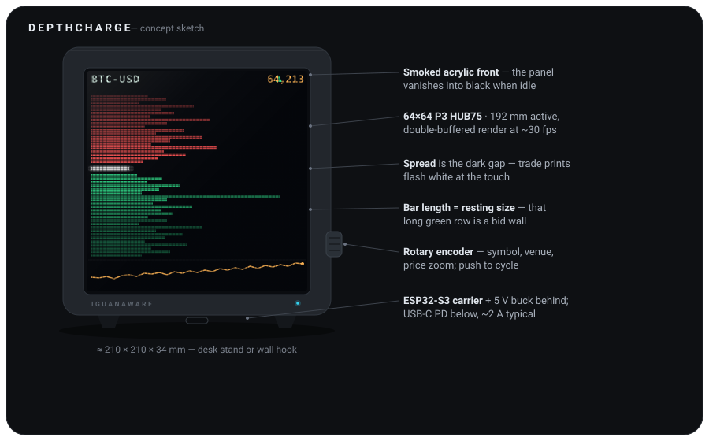

# DepthCharge

A physical limit-order-book display: an ESP32-S3 driving a 64×64 RGB LED matrix behind
smoked acrylic, rendering live market depth — bids stacking green, asks red, trade prints
flashing white at the touch, and an honest grey "stale" state whenever the data can't be
trusted.

**Why the grey state is the point.** On 16 August 2026 the upstream feed went silent for
**two minutes fifty-six seconds** on a TCP connection that stayed perfectly healthy — no
error, no disconnect, plain HTTPS to the same host answering in half a second throughout.
A ladder that kept its colours would have shown a three-minute-old market as live. Had the
panel existed that day it would have shown that incident, for the whole of it. Everything
else here is in service of that: knowing when not to be believed.

Grey is only half of it, though, and the other half is harder. A feed can be arriving,
parsing and rendering perfectly while the book on screen is a hundred seconds behind the
market — that happened on 11 August 2026 with every counter on the board reading healthy.
So the header also carries the book's **age**: an estimate of how far behind the venue this
particular socket has fallen, printed as a number and never as a colour, because *stopped*,
*wrong* and *old* are three different failures and only the first two grey a panel.



It consumes three venues in ascending order of wire difficulty: **Anvil**
([anvil.garethcooke.com](https://anvil.garethcooke.com) — my own C++20 matching engine;
DepthCharge is the second independent client of its versioned wire contract), then
**Kraken** (checksummed L2 deltas), then **Binance** (buffered diffs bracketed against
REST snapshots). Same book engine, one `FeedEvent` vocabulary, three adapters.

**Status:** M1 complete — the Anvil adapter, the phase-1 book and a console ladder run
off the captured traces under `ctest`, including the reconnect trace going visibly stale
and recovering. Next: M2 (panel smoke test, at the bench). See `ROADMAP.md`.

## Layout

```
engine/     portable C++20 book + adapters (no MCU headers — builds on the host)
harness/    replay runner, golden tests, console ladder, bench
firmware/   PlatformIO (ESP32-S3): transport, tasks, HUB75 glue
hardware/   KiCad carrier board, enclosure CAD/STLs, BOM
tools/      capture scripts (Python)
docs/       milestone briefs (the work orders) + vendored protocol snapshots
```

Orientation docs at root: `ARCHITECTURE.md` (the constitution), `ROADMAP.md` (milestones
and status), `CLAUDE.md` (session guide).

## Build (host)

Established in milestone M0 (C++20, GCC ≥13, warnings-as-errors, doctest). One
command configures, builds, and tests from a clean clone:

```bash
cmake --workflow --preset host
```

Iterating? The individual presets also work: `cmake --preset host` (configure),
`cmake --build --preset host` (build), `ctest --preset host` (test). On Windows
with the MinGW-w64 toolchain, use the `host-mingw` presets instead (the default
Windows generator would pick MSVC): `cmake --workflow --preset host-mingw`.
Verified on Ubuntu GCC 13.3; needs CMake ≥ 3.25.

## Watching it run

`dc_ladder` replays a captured trace through the real engine — adapter → book →
`DisplaySnapshot` → console — and draws the ladder:

```bash
build/host/dc_ladder harness/replay/anvil_101_reconnect.ndjson          # report + ladders
build/host/dc_ladder harness/replay/anvil_101_reconnect.ndjson --follow # paced by the capture clock
```

The reconnect trace is the one worth watching: 382 frames in, the feed goes quiet for
4.5 s, the ladder greys with a `STALE — disconnect` banner, and the resync snapshot brings
it back. `--speed 10` to hurry it, `--at N` to stop at a frame, `--no-color`/`--ascii` for
a dumb terminal, `--levels 27` for the full panel budget.

Capturing fresh traces (optional; needs network to the live Anvil server) uses the
stdlib-only tools in `tools/` — no `pip` dependencies:

```bash
python3 tools/capture_anvil.py --ticker 101 --duration 300 --out cap.full.ndjson
python3 tools/slice_trace.py cap.full.ndjson harness/replay/anvil_101_baseline.ndjson --mode baseline --window 90
```

## Development model

Documented in `CLAUDE.md`: milestone briefs in `docs/briefs/` are executed by agentic
sessions converging on the replay harness's golden tests; the hardware track runs at the
bench in parallel. Correctness is pinned by captured wire traces — if it isn't covered by
a replay, it doesn't merge.

Related properties: [Anvil](https://garethcooke.com/projects/anvil) ·
[Crucible](https://garethcooke.com) · [FrontierView](https://garethcooke.com) ·
[garethcooke.com](https://garethcooke.com)
