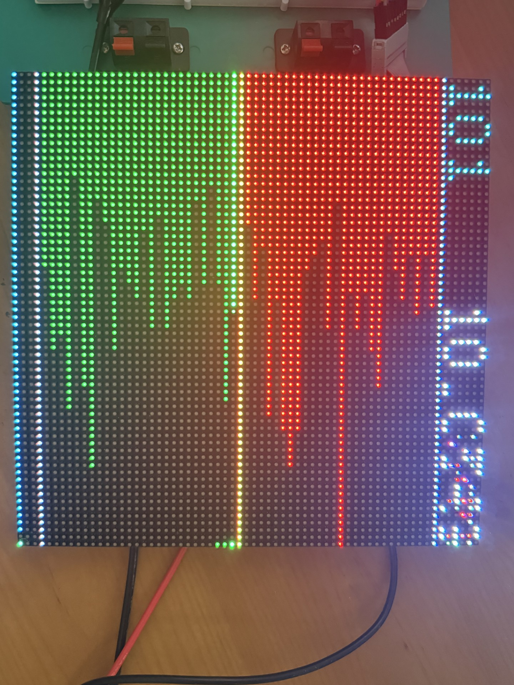

# Bench record — M3 stage D, the panel running, 2026-08-11

Serial capture from the ESP32-S3 (COM5, 115200) with the 64×64 HUB75 panel attached and drawing
a live Anvil ladder. This is stage D's acceptance evidence.



*Bids green below the spread, asks red above it, the amber spread row between them, the header
naming the instrument and the last price, the tape strip along the edge. The panel is shown on
its side. Same `engine/` that runs under `ctest` on the desk.*

**Provenance.** Two runs were captured. The **long run** below is the acceptance record: the
board had been up 28 minutes when logging started and reached **46 minutes** (`millis`
1,689,529 → 2,771,200), giving **18 minutes of continuous capture** with the cumulative counters
carrying the whole 46. Excerpts are quoted rather than the raw log committed, following
`bench-2026-08-09-ws-reconnect.md`'s precedent; the file itself is `firmware/logs/`, untracked.
An earlier short run is referenced only where noted.

## Configuration

```text
panel-hw: psram 8385975 B (present=yes, NOT used for the framebuffer)
panel-hw: dma-internal free=186616 largest=180212 | reserve=98304 budget=88312
I2S-DMA:  Allocating 49152 bytes memory for DMA BCM framebuffer(s).
I2S-DMA:  lsbMsbTransitionBit of 0 gives 105 Hz refresh rate.
S3:       Clock divider is 24
panel-hw: pixel clock: nominal 8 MHz -> divider 24 -> ACTUAL 6.66 MHz
          | refresh: library says 105 Hz, really ~87 Hz
panel-hw: UP: 64x64 depth=6 double-buffered brightness=224
          | predicted=78080 measured=77888 B | dma-internal free 186616 -> 108728
```

The allocation model is confirmed on hardware: **predicted 78,080 against 77,888 and 77,904
measured across two boots — 0.25 % high**, the safe direction. The library's own 49,152 is the
framebuffer alone; the difference is DMA descriptors and allocator bookkeeping, which is the
44 % error `panel_budget.hpp` was rewritten to close. Pin map reads back identical to
`BRINGUP.md`, including the `LAT=12 OE=13 CLK=11` trap.

## Final cumulative block — 46 minutes

```text
-- adapter: in=15688 out=13682 snap=10 book=13528 trade=129 summary=2000
-- errors : parse=21 price=0 ticker=0 unknown=0 trunc=0 backseq=19
-- book   : adopted=13538 trades=129 gaps=15 publishes=13683
-- feed   : frames=15688 wd_gaps=8 sock_gaps=9 connects=10 worst_gap=20598 ms worst_frame=20780 us
-- a->e   : <1:6 1-5:57 5-25:13604 25-100:0 100-500:0 0.5-1k:0 >1k:0 | n=13667 worst=20 ms | qwait=15518 us behind=2/6
-- cpu    : window c0=91% c1=87% over 10030 ms | healthy c0=91% c1=87% n=13651
-- rssi   : now -45 min -52 max -32 dBm n=4677
-- holes  : n=15 board=0 link=15 mixed=0 unknown=0 | burst=0 cadence=14
-- pipe   : published=15688 oversize=0 no_slot=6 qfull=0 abandoned=0 cont=2 ctrl=37
-- channel: published_v=13684 consumed_v=13683 drawn=13470 superseded=214
-- panel  : depth=6 double bright=224 | drew 51 at 5.08/s worst paint 14758 us of 33000 us period
-- rate   : in 6.07/s of 6.07/s attempted (0% lost) | 41.54 KB/s | mean 6997 B | 2.73 chunks/msg
heap: steady after 13418 frames: free=29832 (-364) largest=12276 (-2560) low=20904
```

| Bar (stage C baseline) | Measured over 46 min | |
| --- | --- | --- |
| `a→e` ≤ 22 ms | **20 ms** worst; 13,604 of 13,667 in the 5–25 ms bucket | pass |
| Core 0 ~90 % idle | **91 %**, against a 91 % healthy baseline, n=13,651 | pass |
| Core 1 | **87 %**, against an 87 % baseline | pass |
| pipe drops | `oversize=0 qfull=0 abandoned=0`, `no_slot=6` of 15,688 (0.04 %) | pass |
| loss | **0 %** every window | pass |
| heap `free` delta ≈ 0 | **−364 B** over 13,418 frames | pass |

**The render task costs the feed nothing measurable.** Both cores sit exactly on their healthy
idle baselines across 13,651 samples with the panel drawing throughout. That was the open
question when a panel was first put beside the feed, and it is answered.

`superseded=214` of 13,684 (1.6 %) is the latest-value mailbox dropping frames the consumer was
too slow to take — by design, losing nothing, because every `DisplaySnapshot` is a complete book.

## The headline: the panel told the truth 10.5 seconds before the transport did

Hole #15, and it is invariant #5's entire reason for existing, measured:

```text
2714093  *** STALE (disconnect) at v13493 — panel greys here ***
2724587  open_spare(): feed down 499 ms — opening handle B (attempt #10, dns 620 ms)
2728350  supervise(): socket up on handle B, 4383 ms into attempt #10
2731515  *** LIVE at v13494 ***    grey for 14189 ms before resync
-- hole : #15 15168 ms c0=99%/91% c1=77% rssi=-41 seq+24009 of +2540 -> LINK-BOUND cadence (socket dropped)
```

The RX watchdog greyed the panel at 2,714,093 because book events had stopped. The **socket**
did not notice until ~2,724,088 — `feed down 499 ms` is measured from the transport's own notion
of when it died. **A ten and a half second window in which the panel was already honest and
every transport counter still said everything was fine.** The 2026-08-10 runs showed the same
thing at 6.9 s; this is the largest instance yet.

## The two-handle reconnect, confirmed five times consecutively

```text
attempt #6  -> handle B   socket up 4017 ms
attempt #7  -> handle A   socket up 3940 ms
attempt #8  -> handle B   socket up 3766 ms
attempt #9  -> handle A   socket up 3756 ms
attempt #10 -> handle B   socket up 4383 ms
```

**B → A → B → A → B.** `firmware/README.md` names this as the check that DESIGN §08 strain 14's
undocumented assumption still holds — "if two consecutive recoveries name the same handle, the
assumption has moved and the archive needs re-reading". It alternates perfectly, and the spare
opens **one poll (250–499 ms)** after the drop every time. Bring-up is consistently 3.76–4.38 s,
which is DNS + TCP + TLS + upgrade and is the network's, not ours.

Greys across the run: 4,265 / 4,812 / 4,537 / **131** / 4,409 / 14,189 ms. The 131 ms one is
hole #13 — a watchdog trip on a 1,125 ms silence with no socket involvement, which puts the grey
**994 ms into the silence**: the 1,000 ms deadline, to the log's resolution.

## Every hole is link-bound — none is the board's

```text
-- holes : n=15 board=0 link=15 mixed=0 unknown=0 | burst=0 cadence=14
```

Fifteen out of fifteen, with Core 0 at **98–99 % idle** during each against a 91 % baseline. The
board was waiting for data that was not arriving, never failing to keep up. `rssi` ranged
**−32 to −52 dBm** across the run and the holes cluster at the weak end (−40 to −49), which is
consistent. The stall probe built for exactly this question answers it unambiguously.

## Three findings to carry forward

**1. There is NO fragmentation trend — and the first reading of this record said there was.**

That claim was made from two endpoint samples taken in two different runs (−2,048 after one
reconnect, −2,560 after ten) and it does not survive plotting the trajectory. `largest` across
the 18-minute capture, at every 10 s block:

```text
12,788  for the first ~5 minutes
16,372  from millis 2,013,820 — UP 3,584 B — and held for ~5 minutes
12,788  again from 2,314,466
38,900  transiently at 2,514,762 (socket down, the TLS context freed)
10,740  transiently at 2,731,140 (a TLS handshake in flight)
12,276  for the final four blocks
```

It **oscillates within a small set of discrete values and rose by 3.5 KB mid-run.** `free` sits
at **30,212–30,220 for essentially the whole capture**, dipping only during handshakes and
recovering completely every time. That is an allocator landing on different block sizes as
buffers come and go, which is what `heap_4` does; the −2,560 in the final block is simply where
it happened to be when logging stopped, one bucket below where it spent most of the run.

**So invariant #7's target-side reading passes on both halves** — no leak (`free` flat over
13,418 frames and six reconnects) and no fragmentation drift (`largest` bounded and
non-monotonic). No multi-hour run is needed to establish it.

**What the trajectory does establish is the real headroom.** The tightest moment in the run is a
TLS handshake at `free=21,896 largest=10,740` — about 8 KB below steady state, and it succeeded.
That is the number `kReserveInternalBytes` is protecting, and the reason it should not be lowered
casually.

**2. The connect-burst rejects have collapsed — and `cont` is non-zero for the first time.**
`parse=21` over 15,688 frames is **0.13 %**, about two per connect across ten connects, against
the **~1,281 per connect** the 2026-08-10 entry recorded. What they are has changed too:

```text
-- reject : #1 c5/#1 +174245 ms not-json len=8703 SPLIT@1 head[.{"type":"book","seq":25344555,...
-- reject : #2 c5/#2 +174249 ms not-json len=115  head[t":"10.0274"},{"ticker":106,"restingBuy":...
-- reject : #3 c5/#3 +174249 ms not-json len=34   head[:108,"restingBuy":9223,"restingSel]
```

`#1` is a **`SPLIT@1`** on an 8,703 B payload — two messages in one buffer, which
`firmware/README.md`'s reading table attributes to us, the WebSocket client under burst load.
`#2`–`#4` are consecutive fragments of one large `summary` frame, consistent with truncation at a
chunk boundary.

**And `cont=2`.** Server-side WebSocket fragmentation, non-zero for the first time in the
project. `frame_reassembler.hpp` documents that this IDF vintage does not surface the FIN bit and
therefore publishes such a message *incomplete*, naming the resulting parse error as the correct
failure. Two continuation frames against 21 parse errors is not proof — but it is the **first
evidence for the one hypothesis the 2026-08-10 entry said no capture could ever reproduce**,
because `tools/capture_anvil.py`'s library reassembles WS fragmentation before writing a line.
The parked reassembler item now has a thread to pull.

**3. `worst paint` reaches 14,758 µs, always in a reconnect window.** Steady state is ~2,283 µs
of the 33,000 µs period (7 %). The excursions land where Core 1 drops to 28–35 %, i.e. contention
with the reconnect, and never persist. Worth a second look only if it ever appears without a
reconnect beside it.

## Resolved: the POWERON resets were not a stability problem

The earlier short run showed three `rst:0x1 (POWERON)` resets in its first 35 seconds. **This run
reached 46 minutes of monotonic `millis` with no reset at all** — through ten reconnects, fifteen
holes and a 15-second outage. Whatever caused those three, it is not a recurring fault and does
not hang over the acceptance.

## Still open

- **The deliberate pull-the-Wi-Fi outage is not individually identifiable in this capture.** All
  fifteen holes are socket drops or watchdog trips; no `rejoining (#N)` line appears, meaning
  `WifiSupervisor` never fired and Arduino handled every re-association itself — correct, since
  `BEACON_TIMEOUT`/`NO_AP_FOUND` are both in its reconnectable list. The owner's stopwatch
  figures from a separate attempt (~3 s to grey, ~9 s to recover) decompose correctly: ~1 s of
  watchdog plus ~2 s of data still in flight, and ~4.5 s of re-association plus the measured
  ~3.8 s socket bring-up. **The behaviour the DoD line tests is measured fifteen times over
  above**; what is missing is that one event isolated in a log.
- **`cont=2`** — the first thread to pull on the parked reassembler item, and the only finding
  here that points at a real defect rather than at the link.

**No multi-hour soak is owed.** It was listed here on the strength of a fragmentation trend that
the trajectory above disproves.
